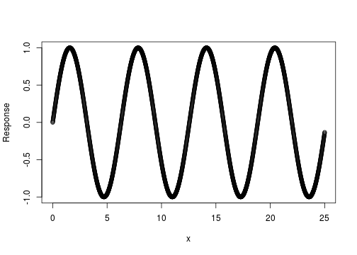
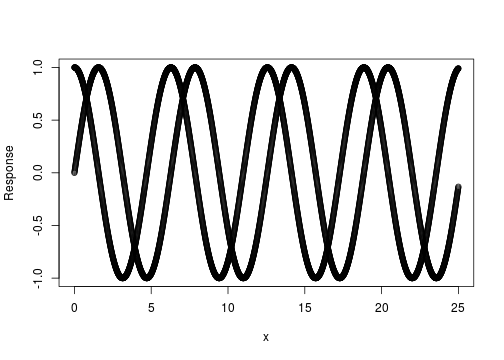
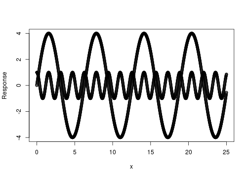
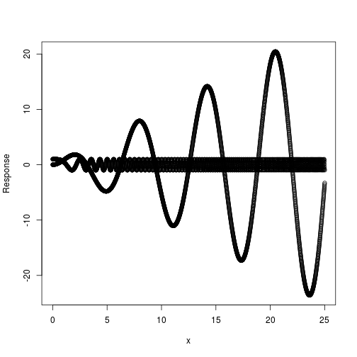

# Developing Data Products
## Course Project

### Matt Frichtl

---

## Trigonometric Graphing Application
### Developing Data Products Course Project

- An interactive application for graphing sine and cosine functions.


```r
x <- seq(0, 25, 0.01)
plot(x, sin(x), type = "p", xlab = "x", ylab = "Response")
```



--- .class #slide 

### Never forget what sine & cosine functions look like again!


```r
x <- seq(0, 25, 0.01)
plot(c(x, x), c(sin(x), cos(x)), type = "p", xlab = "x", ylab = "Response")
```



--- .class #slide -

### Or what changes to the function parameters do!


```r
x <- seq(0, 25, 0.01)
plot(c(x, x), c(4 * sin(x), cos(4 * x)), type = "p", xlab = "x", ylab = "Response")
```



--- .class #slide -

### Easy to modify --- add other parameters as well


```r
x <- seq(0, 25, 0.01)
plot(c(x, x), c(x * sin(x), cos(x^2)), type = "p", xlab = "x", ylab = "Response")
```


